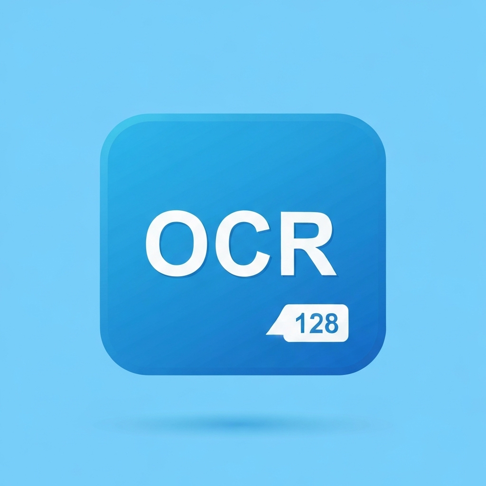
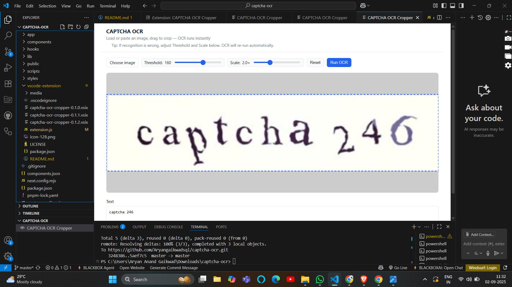

# CAPTCHA OCR Cropper (VS Code Extension)

[GitHub Repository](https://github.com/Aryangaikwadsql/captcha-ocr)

A VS Code extension that opens a webview where you can load or paste an image, drag a crop rectangle, and run OCR on the cropped area using OCR.space.

Features:
- Load image via file picker, drag-and-drop, or paste from clipboard
- Drag to crop visually on a canvas
- Run OCR and see text, confidence, and duration; copy the result
- Instant OCR runs automatically as soon as you finish drawing a crop and whenever you adjust the Threshold or Scale sliders (debounced).
- Preprocessing (upscaling + grayscale threshold) happens locally in the webview before sending the image to the OCR API.
- If the output is wrong, adjust the Threshold and Scale sliders; OCR re-runs instantly and cleaner binarization usually improves accuracy.

Configuration:
- Settings → “CAPTCHA OCR Cropper”:
  - `captchaOcr.ocrSpaceApiKey`: OCR.space API key (default `helloworld` demo key)
  - `captchaOcr.language`: OCR language code (default `eng`)
  - `captchaOcr.engine`: Engine 1 or 2 (default 2)

Usage:
- Command Palette → “CAPTCHA OCR: Open Cropper”
- Load/paste an image, draw a crop, click “Run OCR”
- Adjust the threshold and scale sliders until the characters are cleanly black-and-white; the extension will re-run OCR instantly.

Notes:
- Replace the demo key with your own for production use.
- If you need offline OCR, we can switch to a bundled Tesseract.js worker. If you meant a Visual Studio (Windows) VSIX instead of VS Code, tell me and I’ll generate that template.
